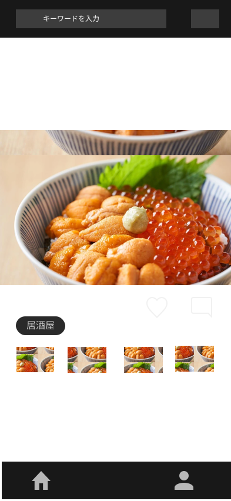

# 要件定義
## アプリケーション概要
本アプリケーションは料理メニューにアプローチした飲食店検索アプリです 

## 現状のサービスについて
### 現状のユーザーフロー
現状の飲食店検索アプリ（食べログ、ホットペッパーグルメなど）での予約までのユーザーフローとしては以下のようになっています。 

一覧ページでは店名や評価、写真、価格帯などの情報が含まれており、それらがカード形式で20件ほど表示されています。 
ユーザーは一覧ページで気になった店をクリックすることで詳細ページへと移り、そこでコースや料理メニュー、口コミなど確認することができます。 
口コミやメニューなどを確認したうえで気に入ったら予約するという形になっています。 

### 現状の問題点
現在のユーザーフロー(一覧ページから詳細ページの流れ)の問題点として**飲食店の魅力を最大限に伝えられていない点**があります。 
ユーザーは一覧ページにて気になった店をクリックすることで詳細ページへと体験していきますが、 
この気になった店というのは**料理が美味しそう**だけではなく**評価が高い**などの情報で判断していると思います。 

**具体的な課題**
- 一覧情報では料理の魅力が伝わりにくい
- 新規店舗はなかなか発見されにくい
- 評価に依存した選択になりがち(評価がないアプリもある。)
- スマホでの一覧表示は見にくく、使いずらい。

## 解決策
### コンセプト
**「料理写真を中心とした直感的な飲食店発見体験」**
インスタグラムのような写真中心のスライド形式を採用し、料理の視覚的な魅力を最優先で伝えることで、ユーザーが直感的に「食べてみたい」と思える体験を提供します。

### アプローチ方法
1. **写真ファーストのUI/UX**
   - 料理写真を大きく表示
   - スライド形式での閲覧
   - 直感的な操作感

2. **料理中心の情報設計**
   - 料理名、価格、店舗名の最小限の情報
   - 評価や口コミは補助情報として配置

3. **発見体験の最適化**
   - 新規店舗も平等に発見される機会を提供
   - 料理の魅力で勝負できる環境

### 競合サービスとの差別化
**食べログ・ホットペッパーグルメ**
- 視覚的に伝わりやすい料理の魅力。
- 評価制度の廃止。
- スマホ用に特化したUI構成。

**インスタグラム**
- 詳細な店舗情報
- ソート機能

## 目的
本アプリではメニュー中心にアプローチすることで**直感的に料理の魅力を伝える**ことを目的にしています。 

## 提供できる価値
このコンセプトでは以下のような価値を提供できます。

1. **直感的な「食べてみたい」を実現する**
   - 料理にアプローチすることでユーザーは視覚的に料理の魅力を感じ取れる
   - 評価に依存せず、料理自体の魅力で判断できる

2. **多くの出会いを提供**
   - ユーザーは新規店舗や隠れた名店を発見できる
   - 料理の魅力で勝負できるため、知名度に関係なく発見される機会が増える

3. **シンプルで直感的な体験**
   - 複雑な情報に惑わされず、料理の本質的な魅力に集中できる
   - スマホにターゲットしたデザインで使いやすいUI。

## ターゲットユーザー
- **年齢**: 10代〜30代
- **職業**: 学生〜会社員
- **特徴**: 
  - インスタグラムなどのSNSを日常的に利用
  - 新しい飲食店の発見を楽しむ
  - 直感的な操作を好む
  - ランチタイムにスマホで近くの飲食店を検索

- **年齢**: 20代〜50代
- **職業**: 飲食店経営
- **特徴**:
  - 数年前に飲食店を経営
  - 新規顧客の取得に苦労

## 機能要件
### topページ

- ログイン済みのユーザーはいいね、コメントができる。
- 各店舗の投稿は4つまで閲覧できる。
- 各投稿は料理の写真、名前、値段で構成される。
- 店舗の情報として店舗名とタグ、住所を表示する。
- 店舗名をタップすることで詳細ページへと遷移。
- 店舗はデータベースから20件取得する。
- データベースからの取得はデフォルトの場合、ランダムに並び替えて取得(できるかわからない。)
- スライドすることで次の店舗を見る。

### 詳細ページ

- 写真、コメント、住所を表示する。
- 写真はtopに表示してあった4枚。
- コメントはユーザー名、アイコン、内容で構成。
- 住所はmapboxのapiを利用して表示する。

### 検索機能

- 検索はジャンル、タグ、地域で検索。
- ジャンルは1つのみ選択。(例  居酒屋や寿司、焼肉など)
- タグは3つまで選択可能。(例  24時間営業、ネット予約可能など)
- 地域は都道府県まで選択できる(悩み中。都市まで検索したい気もする。)

### ユーザー情報ページ

- ユーザーのアイコンとユーザー名を表示
- いいねした投稿は一覧表示する
- ユーザー情報は編集可能。

### 非機能要件
- レスポンシブはスマホサイズのみ(iphone16を想定。)
- 管理者ページのみスマホ、pcに対応。