# 要件定義
## アプリケーション概要
本アプリケーション「foodsnap」は料理メニューを中心にアプローチし、料理の魅力を直感的に伝え、 

## 現状のサービスについて
### 現状のユーザーフロー
現状の飲食店検索アプリ（食べログ、ホットペッパーグルメなど）での予約までのユーザーフローとしては以下のようになっています。 

一覧ページでは店名や評価、写真、価格帯などの情報が含まれており、それらがカード形式で20件ほど表示されています。 
ユーザーは一覧ページで気になった店をクリックすることで詳細ページへと移り、そこでコースや料理メニュー、口コミなど確認することができます。 
口コミやメニューなどを確認したうえで気に入ったら予約するという形になっています。 

### 現状の問題点
現在のユーザーフロー(一覧ページから詳細ページの流れ)の問題点として**飲食店の魅力を最大限に伝えられていない点**があります。 
ユーザーは一覧ページにて気になった店をクリックすることで詳細ページへと体験していきますが、 
この気になった店というのは**料理が美味しそう**だけではなく**評価が高い**などの情報で判断していると思います。 

**具体的な課題**
- 一覧情報では料理の魅力が伝わりにくい
- 新規店舗はなかなか発見されにくい
- 評価に依存した選択になりがち(評価がないアプリもある。)
- スマホでの一覧表示は見にくく、使いずらい。
- 詳細ページ <=> 一覧ページの切り替えが面倒

## 解決策
### コンセプト
**「料理写真を中心とした直感的な飲食店発見体験」**
インスタグラムのような写真中心のスライド形式を採用し、料理の視覚的な魅力を最優先で伝えることで、ユーザーが直感的に「食べてみたい」と思える体験を提供します。

### アプローチ方法
1. **写真ファーストのUI/UX**
   - 料理写真を大きく表示
   - スライド形式での閲覧
   - 直感的な操作感

2. **料理中心の情報設計**
   - 料理名、価格、店舗名の最小限の情報
   - 評価や口コミは補助情報として配置

3. **発見体験の最適化**
   - 新規店舗も平等に発見される機会を提供
   - 料理の魅力で勝負できる環境

### 競合サービスとの差別化
**食べログ・ホットペッパーグルメ**
- 視覚的に伝わりやすい料理の魅力。
- 評価制度の廃止。
- スマホ用に特化したUI構成。

**インスタグラム**
- 詳細な店舗情報
- ソート機能

## 目的
本アプリではメニュー中心にアプローチすることで**直感的に料理の魅力を伝える**ことを目的にしています。 

## 提供できる価値
このコンセプトでは以下のような価値を提供できます。

1. **直感的な「食べてみたい」を実現する**
   - 料理にアプローチすることでユーザーは視覚的に料理の魅力を感じ取れる
   - 評価に依存せず、料理自体の魅力で判断できる

2. **多くの出会いを提供**
   - ユーザーは新規店舗や隠れた名店を発見できる
   - 料理の魅力で勝負できるため、知名度に関係なく発見される機会が増える

3. **シンプルで直感的な体験**
   - 複雑な情報に惑わされず、料理の本質的な魅力に集中できる
   - スマホにターゲットしたデザインで使いやすいUI。

## ターゲットユーザー
- **年齢**: 10代〜30代
- **職業**: 学生〜会社員
- **特徴**: 
  - インスタグラムなどのSNSを日常的に利用
  - 新しい飲食店の発見を楽しむ
  - 直感的な操作を好む
  - ランチタイムにスマホで近くの飲食店を検索

- **年齢**: 20代〜50代
- **職業**: 飲食店経営
- **特徴**:
  - 数年前に飲食店を経営
  - 新規顧客の取得に苦労

## 機能要件
### topページ
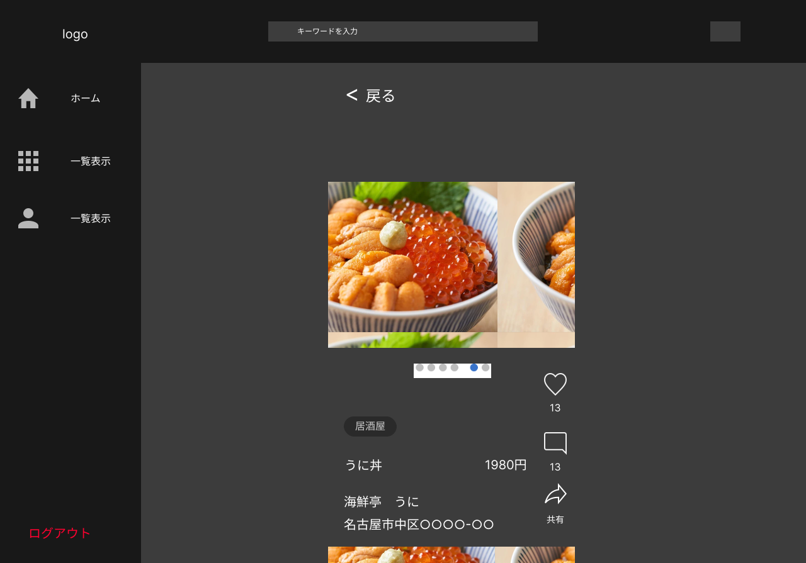
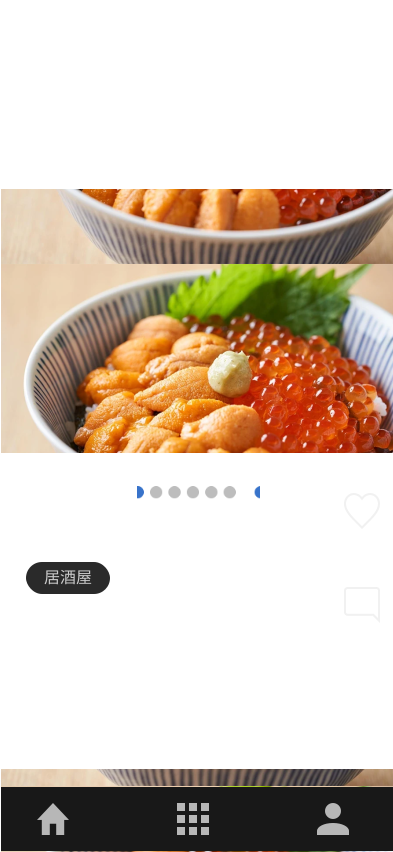
- ログイン済みのユーザーはいいね、コメントができる。
- 各店舗のメニューを4つまで表示する。
- 各投稿(メニュー)は料理の写真、名前、値段で構成される。
- 店舗の情報として店舗名とタグ、住所を表示する。
- 店舗名をタップすることで詳細ページへと遷移。
- 現在地から半径3kmいないの店舗をランダムに表示する。
- 左右スライドでメニューの切り替え、上下スライドで店舗の切り替えができるようにする。
- 位置情報の取得に失敗、半径3kmいないのデータを全て取得した場合、以降は完全ランダムに表示する。
- dbから20件取得し、10件閲覧されたらfetchする(ユーザー体験向上)

### 一覧、検索結果表示ページ
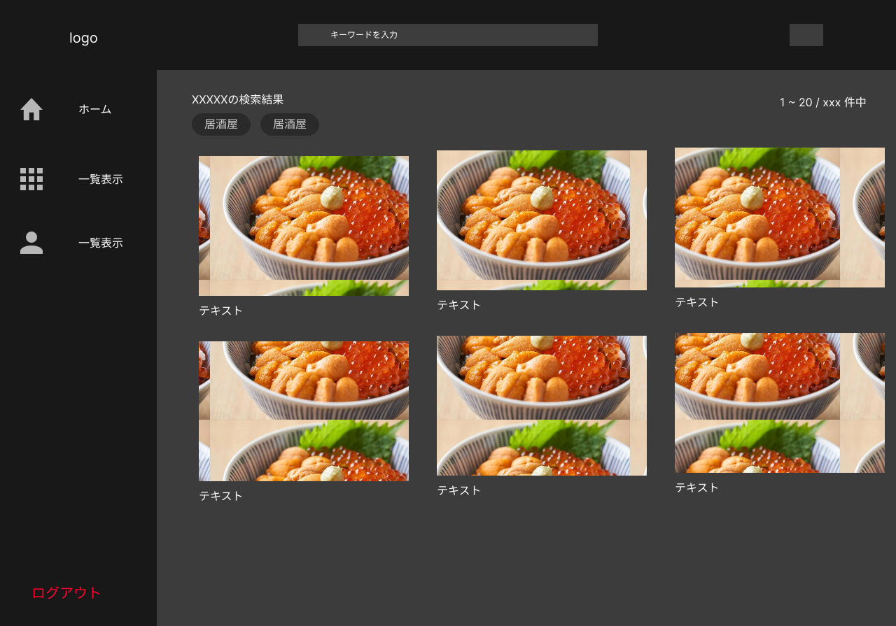
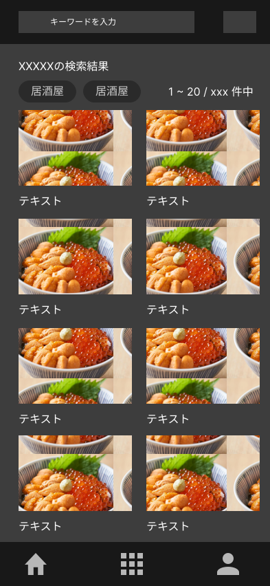
- 検索結果やフッターの中央2つ目をクリックしたときに遷移する。
- 一覧ページでは店舗画像1枚と店名で構成して表示する。
- 一覧ページからクリックされた店舗はモーダルで表示する。
- モーダルではtopページと同様、左右スライドでメニューの切り替え、上下スライドで店舗切り替えが可能
- backボタンを押すことでモーダルを閉じ、元に戻す(topとの相違点)

### 詳細ページ

- 写真、コメント、住所を表示する。
- 投稿された料理の写真と説明を表示する。
- コメントはユーザー名、アイコン、内容で構成。
- 住所はmapbox GL JSを使って表示

### 検索機能
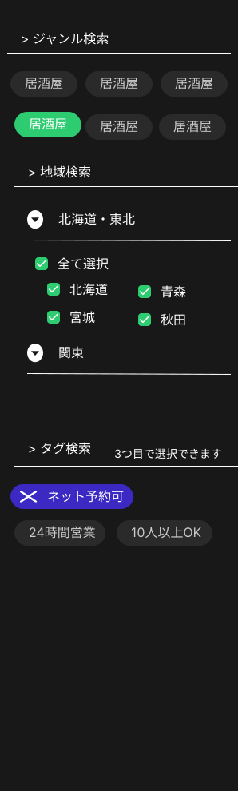
- pc,sp共通デザイン
- 検索はジャンル、タグ、地域で検索。
- ジャンルは1つのみ選択。(例  居酒屋や寿司、焼肉など)
- タグは3つまで選択可能。(例  24時間営業、ネット予約可能など)
- 地域は都道府県まで選択できる(悩み中。都市まで検索したい気もする。)

### ユーザー情報ページ
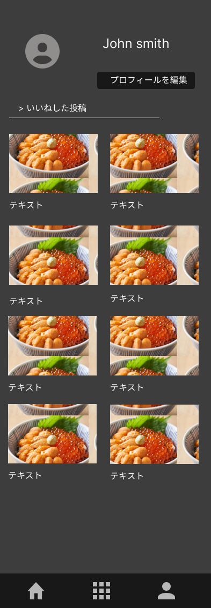
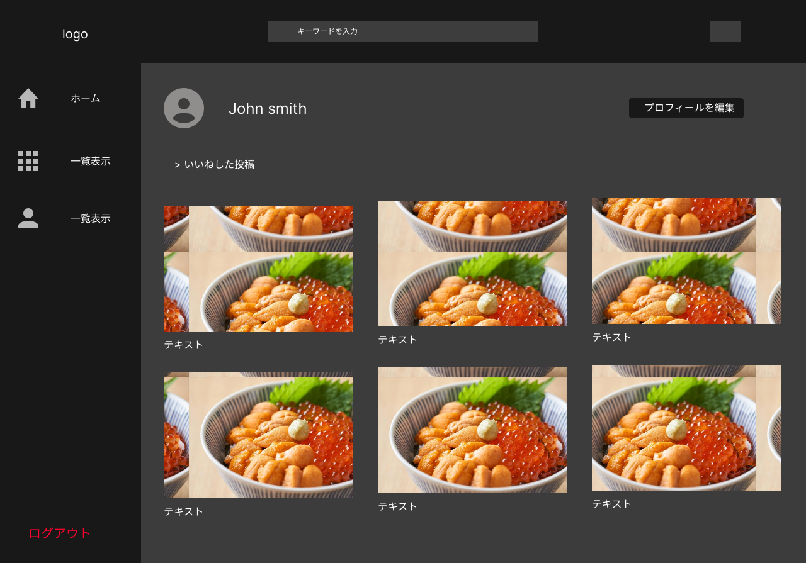
- ユーザーのアイコンとユーザー名を表示
- いいねした投稿は一覧表示する
- ユーザー情報は編集可能。

### コメント機能
- ログイン済みユーザーは店舗についてコメントができる。
- 評価は無しで、コメントの画像はなし、テキストのみ。
- コメントはユーザーアイコン、ユーザー名、内容を表示。
- コメントは同一ユーザーでも複数投稿できる。

### ユーザー登録
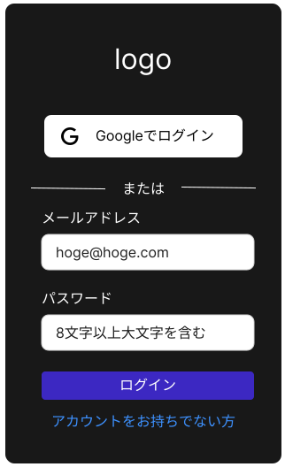
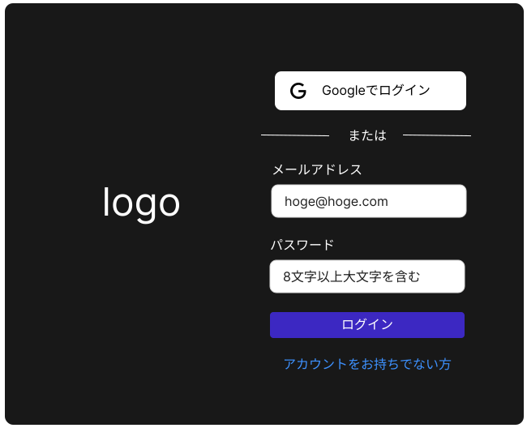
- ユーザー登録はメール登録とgoogle認証で行う。
- ユーザー情報として、ユーザー名、メールアドレス、パスワードを入力させる。

### 店舗登録
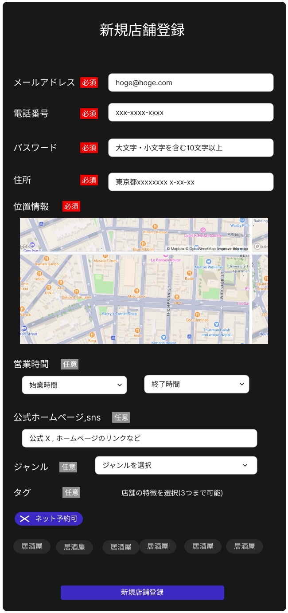
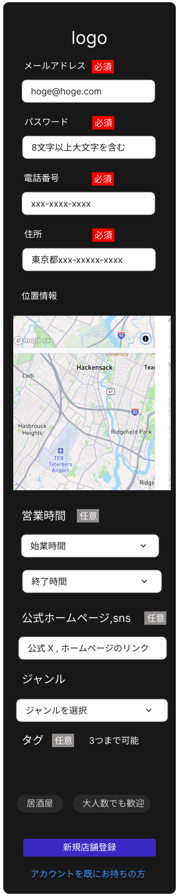
- 店舗登録は管理者用ページを公開してアクセスできるようにする。
- emailとパスワードを使ってログインできるようにする。
- 店舗情報として電話番号、住所、位置情報を必須項目に設定する。
- 任意の情報として営業時間、snsリンク、ジャンル、タグを登録できるようにする。
- 位置情報登録はmapbox GL JSを使ってピン差し登録。

### 店舗管理者画面
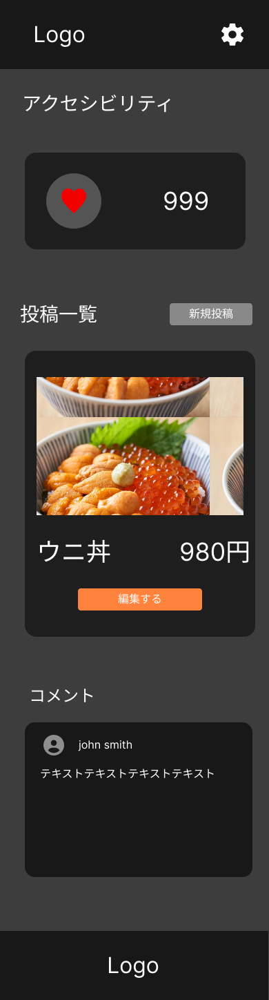
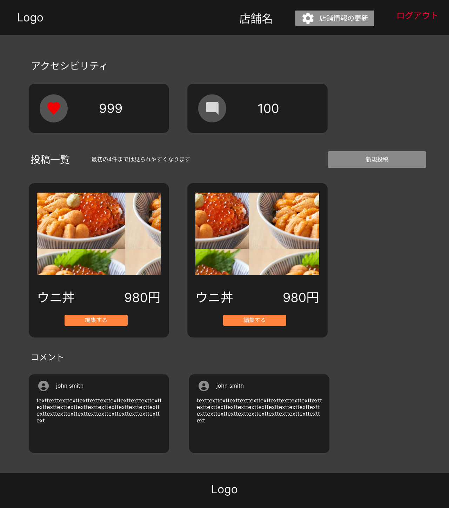
- いいね数、コメント数の表示
- 投稿した内容の確認
- 最新順でコメントを表示
- ヘッダーの店舗情報の更新を押すことで店舗情報を更新することができる

### メニュー投稿・更新機能
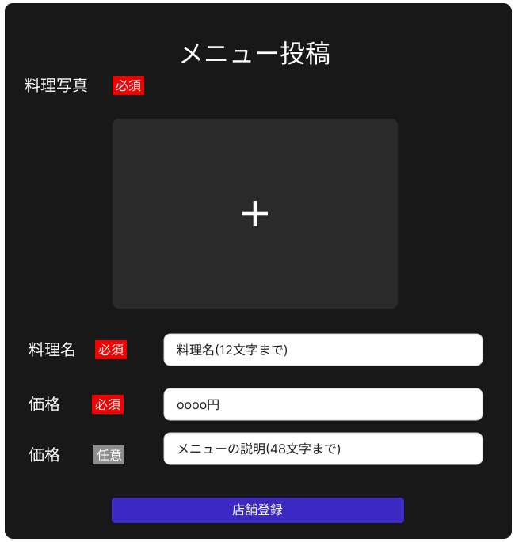
- 料理の写真、名前、価格は必須項目。
- 説明は任意とする。
- 最初に投稿された4件はモーダル、topページにて表示される。

### 非機能要件
- ユーザーページはスマホファーストでpcにも対応
- セキュリティ対策