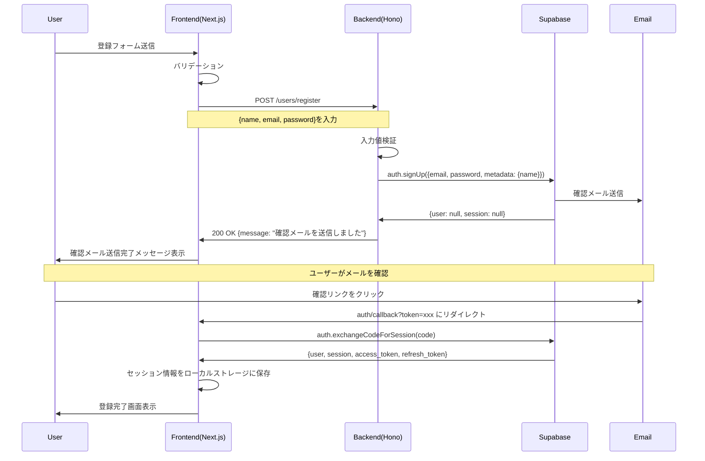
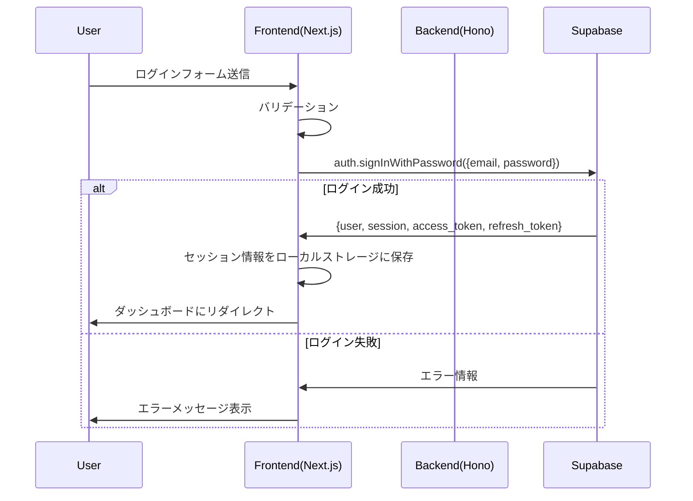
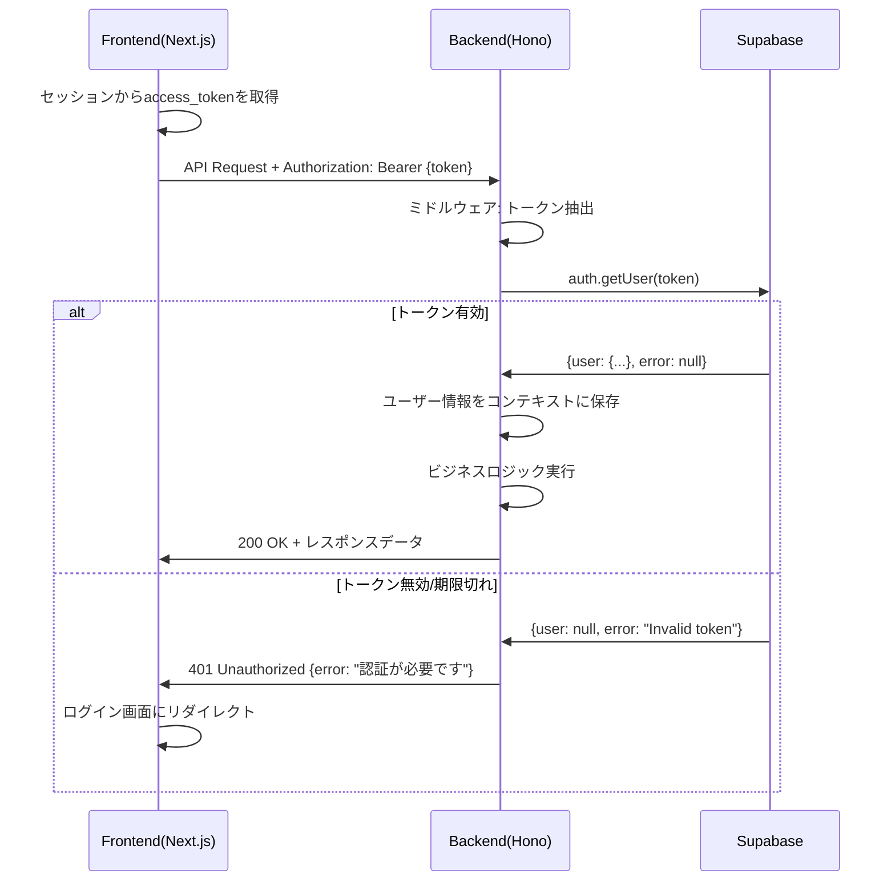
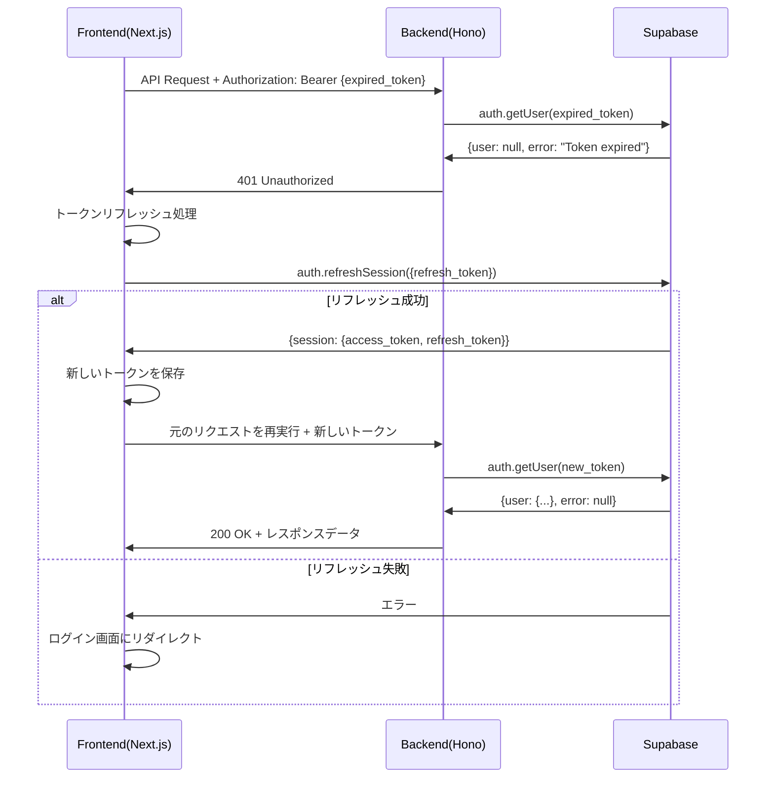

# システム設計
## 技術スタック
### next.js(front)
- vercelを使って簡単にプロジェクトをデプロイできる。
- CSR, SSR, SSGが使えるため、パフォーマンスとSEOの両立が可能
- 豊富なコミュニティ

### Hono.js,Prisma(backend)
- 軽量かつ高速なフレームワーク
- cloudflare workersにデプロイすることができ、エッジコンピューティングによる低遅延を実現できる
- Prismaを使ってORMによるCRUD操作

### supabase(DB、認証)
- PostgreSqlのリレーショナルデータベースに対応
- メール認証やOAuth認証などを簡単に使える
- 高度なDBのセキュリティ

### mapbox GL JS(地図API)
- 地図で店舗登録、表示が可能。
- モダンなデザイン。
- 料金体制がマッチ(月間リクエストが50000以下なら無料)

## 画面設計図
figma 
https://www.figma.com/design/6EykxcbLh6zb7I9fAZMVXd/%E7%84%A1%E9%A1%8C?node-id=2-2&t=ANLkUqDYXZkGkP2M-1

## 画面遷移図
miro
https://miro.com/welcomeonboard/clhJVG9xYWtQVmdZc0dnaGwzODQxeTYyeXZKdGJHYjlnWkZ0OHNxNHFhZ1UwT2hUVFlqdVl5R3RUV3paV2tUbUdoZS81NndxZjk3VGVyMHpHcFFlS1pJMU1lTUMvNE9vT3FVSnA5QzkvZTZpVG5hKy83bVRlV2RvTk9ORVVpMnFzVXVvMm53MW9OWFg5bkJoVXZxdFhRPT0hdjE=?share_link_id=150226919505

## ユーザーフロー図
miro
https://miro.com/welcomeonboard/Zmh5WDJkYXpHRUgrR0JycDI2VkcxZ3BHWm9oc3NBMFVrZ29zVWVsR0hEdTlCMDNRS1M4VWhRR0RjRXVHRkZyTU85ZDYxcUJHT3pqRFA0cnBzSFlDbnBJMU1lTUMvNE9vT3FVSnA5QzkvZTRqbnFENVBTMUM3ZFJJdjFuK3o3T3ZQdGo1ZEV3bUdPQWRZUHQzSGl6V2NBPT0hdjE=?share_link_id=75773470844

## ER図
draw.io
https://drive.google.com/file/d/1qV1Dv1KH6ZRUzyeQ4BoQLkxpWG9-iuh7/view?usp=drive_link

## API仕様書
`api.yaml`を参照

## ユーザー認証、apiに関するアーキテクチャ
### 1. ユーザー登録フロー

### 2. ログインフロー

### 3. API認証フロー

### 4. トークンリフレッシュフロー

## テーブル定義図